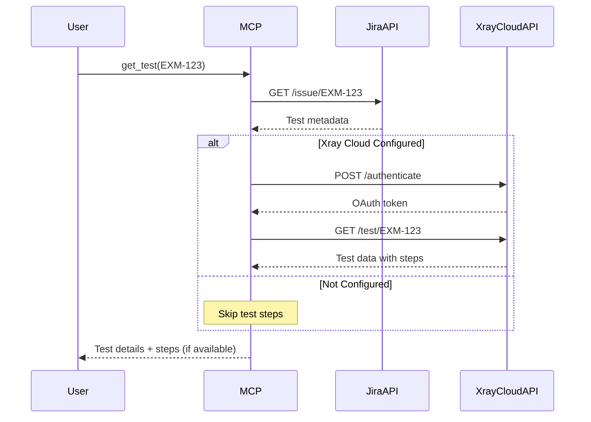

# Xray Cloud API Implementation Summary

## What Was Implemented

This implementation adds **Xray Cloud API v2** support to the XRay MCP, enabling the fetching of test steps from Xray Cloud.

## Changes Made

### 1. Updated Type Definitions (`src/types.ts`)
- Added optional `XRAY_CLIENT_ID` and `XRAY_CLIENT_SECRET` to `ConfigSchema`
- Added `XrayCloudToken` interface for token caching

### 2. Created Xray Cloud Service (`src/services/XrayCloudService.ts`)
**New file** implementing:
- Singleton pattern for managing Xray Cloud API connections
- OAuth2 authentication with token caching (50-minute expiry)
- Automatic token refresh
- Methods:
  - `authenticate()` - Gets/refreshes OAuth token
  - `getTest(testKey)` - Fetches complete test data including steps
  - `getTestSteps(testKey)` - Fetches test steps specifically
  - `isConfigured()` - Checks if credentials are set

### 3. Updated Test Fetching (`src/tools/tests/getTest.ts`)
- Integrated `XrayCloudService` for fetching test steps
- Falls back gracefully if Xray Cloud API is not configured
- Extracts and formats test steps from Xray Cloud response
- Maps Xray step format to internal format:
  - `action` → `step`
  - `data` → `data`
  - `expectedResult` → `result`

### 4. Updated Main Server (`src/index.ts`)
- Added `XRAY_CLIENT_ID` and `XRAY_CLIENT_SECRET` to environment variable parsing
- Passes credentials to config

### 5. Documentation Updates
- **README.md**: Added sections on Xray Cloud API setup
- **XRAY_CLOUD_SETUP.md**: Comprehensive setup guide
- **XRAY_CLOUD_IMPLEMENTATION.md**: This document

## How It Works



## Authentication Flow

1. **First Request:**
   ```
   POST https://xray.cloud.getxray.app/api/v2/authenticate
   Body: { client_id, client_secret }
   Response: "eyJhbGciOiJIUzI1NiI..." (JWT token)
   ```

2. **Subsequent Requests:**
   ```
   GET https://xray.cloud.getxray.app/api/v2/test/{testKey}
   Header: Authorization: Bearer {token}
   Response: { steps: [...], ... }
   ```

3. **Token Caching:**
   - Tokens cached in memory for 50 minutes
   - Automatically refreshed when expired
   - No persistence (re-authenticates on server restart)

## API Endpoints

### Xray Cloud API v2
- **Base URL:** `https://xray.cloud.getxray.app/api/v2`
- **Authentication:** `POST /authenticate`
- **Get Test:** `GET /test/{testKey}`

### Jira REST API v3 (unchanged)
- **Base URL:** `{JIRA_BASE_URL}/rest/api/3`
- **Search:** `POST /search/jql`
- **Get Issue:** `GET /issue/{issueKey}`

## Configuration

### Required Environment Variables
```bash
JIRA_BASE_URL=https://your-instance.atlassian.net
JIRA_EMAIL=your-email@example.com
JIRA_API_TOKEN=ATATT...
```

### Optional Environment Variables (for test steps)
```bash
XRAY_CLIENT_ID=xxxxxxxx-xxxx-xxxx-xxxx-xxxxxxxxxxxx
XRAY_CLIENT_SECRET=xxxxxxxxxxxxxxxxxxxxxxxxxxxxxxxx
```

## Backward Compatibility

✅ **Fully backward compatible**
- Works without Xray Cloud credentials
- Gracefully falls back if credentials not configured
- Logs informative messages when test steps can't be fetched
- All existing functionality remains unchanged

## Example Output

### Without Xray Cloud API:
```
**Test: EXM-123**
**Summary:** Verify bookmarking content from content page
**Details:**
- Status: New
- Priority: Medium
...
```

### With Xray Cloud API:
```
**Test: EXM-123**
**Summary:** Verify bookmarking content from content page
**Details:**
- Status: New
- Priority: Medium
...

**Test Steps:**

1. **Action:** Login to expert
   **Data:** dev env: https://your-app-dev.example.com/
   **Expected Result:** User logged in

2. **Action:** Click on Meny-> Bokmerker
   **Data:** None
   **Expected Result:** Modal with the view of the list of saved articles
```

## Testing

To test the implementation:

```bash
# Build the project
npm run build

# Test with credentials
JIRA_BASE_URL="..." \
JIRA_EMAIL="..." \
JIRA_API_TOKEN="..." \
XRAY_CLIENT_ID="..." \
XRAY_CLIENT_SECRET="..." \
node dist/index.js
```

Then in Cursor, try:
```
Get test EXM-123
```

## Error Handling

The implementation handles:
- ❌ Missing credentials (graceful degradation)
- ❌ Invalid credentials (clear error messages)
- ❌ Network failures (retry on next request)
- ❌ Token expiration (automatic refresh)
- ❌ API rate limits (clear error messages)
- ❌ Tests without steps (no error, just empty)

## Performance

- **Token Caching:** Reduces API calls
- **Lazy Authentication:** Only authenticates when needed
- **Singleton Pattern:** One service instance per server
- **No Blocking:** Errors don't prevent basic test info retrieval

## Security Considerations

✅ Tokens stored in memory only (not persisted)
✅ Tokens expire after 1 hour
✅ Credentials passed via environment variables
✅ No credentials in logs
✅ HTTPS for all API calls

## Future Enhancements

Possible improvements:
1. Support for other test types (Cucumber, Generic)
2. Fetch test executions with step results
3. Update test steps via API
4. Bulk test operations
5. Test step attachments
6. Better error recovery

## Files Changed

```
src/
├── types.ts                          [MODIFIED]
├── index.ts                          [MODIFIED]
├── services/
│   └── XrayCloudService.ts          [NEW]
└── tools/
    └── tests/
        └── getTest.ts                [MODIFIED]

README.md                             [MODIFIED]
XRAY_CLOUD_SETUP.md                  [NEW]
XRAY_CLOUD_IMPLEMENTATION.md         [NEW]
```

## Build & Deploy

```bash
# Install dependencies (if needed)
npm install

# Build TypeScript
npm run build

# Output in dist/ directory
```

## References

- [Xray Cloud REST API v2](https://docs.getxray.app/display/XRAYCLOUD/REST+API)
- [Xray Authentication](https://docs.getxray.app/display/XRAYCLOUD/Authentication+-+REST+v2)
- [Xray Tests API](https://docs.getxray.app/display/XRAYCLOUD/Tests+-+REST+v2)

